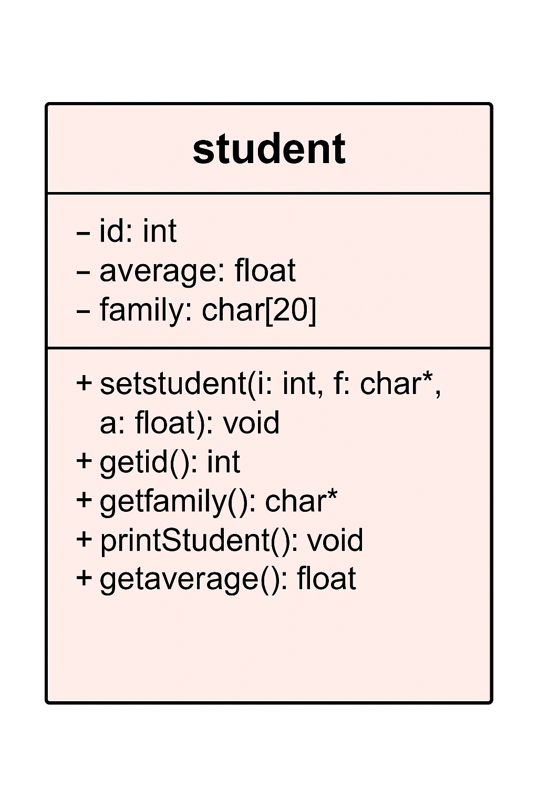

# 🧑‍🎓 Student Management - OOP Project

This project demonstrates basic Object-Oriented Programming (OOP) concepts in C++. It defines a `student` class to manage student information such as ID, name, and average score.<br><br>

<div align="center">
  
</div><br><br>

## 📌 Features

- Create and store multiple student records
- Input and store:
  - Student ID
  - Family name
  - Average score
- Validate data (ID and average must be in valid range)
- Display students with an average greater than 17

## Code Structure

- **Class: `student`**
  - **Private Members:**
    - `int id`
    - `float average`
    - `char family[20]`
  - **Public Methods:**
    - `setstudent()` – sets values with validation
    - `getid()` – returns student ID
    - `getfamily()` – returns family name
    - `getaverage()` – returns average score
    - `printStudent()` – prints student info

- **Main Function:**
  - Accepts number of students
  - Dynamically allocates array of students
  - Reads student data from input
  - Prints IDs and family names of students with average > 17
  - Frees memory at the end


## Requirements

- C++ compiler (e.g., g++)
- Basic understanding of pointers and classes

## How to Compile

```bash
g++ -o student student.cpp


