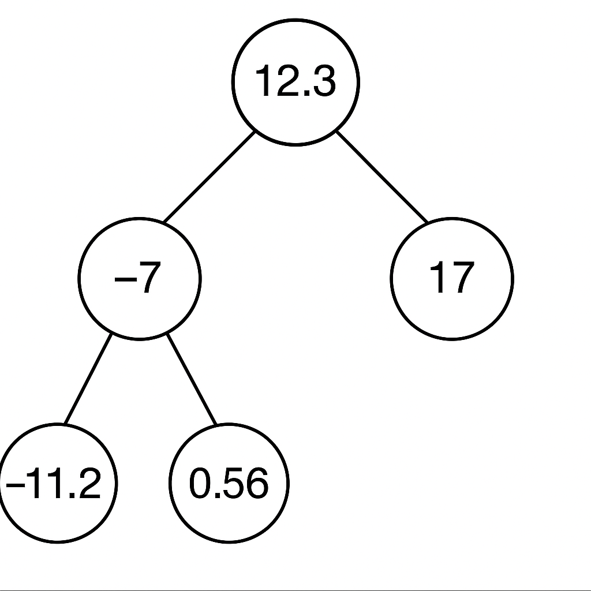

# 🌳 Binary Tree in C++

This project implements a **Binary Search Tree (BST)** in C++. It includes insertion, deletion, traversal, node counting, duplicate removal, and lower bound functionality.

---

  

---
## 🌱 What is a Binary Tree?

A **Binary Tree** is a hierarchical data structure where each node has at most **two children**: a left child and a right child.

A **Binary Search Tree (BST)** is a special kind of binary tree where:
- The **left child** is less than the parent node.
- The **right child** is greater than or equal to the parent node.

This allows for efficient searching, insertion, and deletion operations.

---

## ✨ Features

This implementation supports the following features:

| Feature                  | Description |
|--------------------------|-------------|
| ✅ Insert                | Add new nodes to the tree while maintaining BST property |
| ✅ In-order Traversal     | Print nodes in sorted order |
| ✅ Pre-order Traversal    | Print nodes in root-left-right format |
| ✅ Count Leaf Nodes       | Count nodes with no children |
| ✅ Count Non-Leaf Nodes   | Count internal nodes (with at least one child) |
| ✅ Delete Node            | Remove a specific node (with 0, 1, or 2 children) |
| ✅ Remove Duplicates      | Eliminate duplicate values |
| ✅ Lower Bound Finder     | Find the smallest value greater than or equal to a given input |

---
## 📥 Sample Input

7
1 12.3
1 -7
1 0.56
1 -11.2
1 17
2
3
4

## 📤 Sample Output

in order:-11.2 -7 0.56 12.3 17 
pre order:12.3 -7 -11.2 0.56 17 
The number of leaf:3
The number of non-leaf:2

---

## Interact via CLI – choose operations:

1 x  => Insert x
2    => Display (in-order & pre-order)
3    => Count leaf nodes
4    => Count non-leaf nodes
5 y  => Delete y
6    => Remove duplicates
7 z  => Lower bound of z

