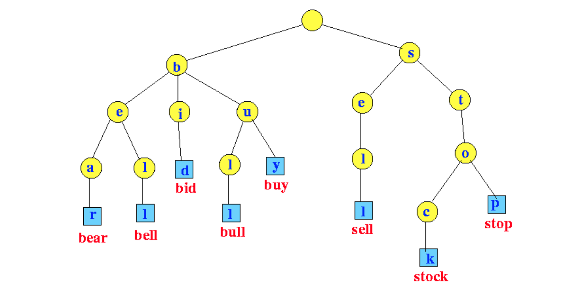

# 🌲 Trie Tree Project in C++

This project demonstrates the use of a **Trie Tree (Prefix Tree)** to efficiently insert integers and find the **maximum XOR** of a given number with previously inserted numbers.

---

  

---

## 📖 What is a Trie Tree?

A **Trie Tree** is a tree-like data structure used to efficiently store and retrieve keys in a dataset of strings or binary representations. Each node in the trie represents a bit or character, and the path from the root to a leaf node represents a full key.

In this project, the trie is used to store the **binary representation of integers**, making it efficient for bitwise operations like finding the maximum XOR value.

---

### ✅ Why Use Trie for XOR?

To find the **maximum XOR** of a number with previously inserted numbers, a binary trie helps by traversing the opposite bits (0 vs 1) at each level to maximize the XOR result.

For example:
- Binary of `5` is `000...0101`
- Binary of `10` is `000...1010`
- Their XOR is `000...1111` → `15` (maximum possible from those two)

---

## ⚙️ Project Description

This project supports two operations:

| Input Command | Description                             | Example Input   |
|---------------|-----------------------------------------|-----------------|
| `1 x`         | Insert integer `x` into the trie        | `1 5`           |
| `2 x`         | Find max XOR of `x` with inserted nums  | `2 10` → `15`   |

The trie is built on **21 bits (0–20)** assuming input integers are within that bit range.

---

## 📦 How It Works

- **Insertion (`insert`)**: Converts the number to binary and creates paths in the trie from MSB to LSB.
- **XOR Query (`max_xor`)**: Traverses the trie to always pick the *opposite bit* (if it exists) at each level to maximize the XOR result.

---

## 📌 Notes

- Assumes integers fit in 21 bits (max value ~2 million).

- Trie nodes are binary: each has children[0] and children[1].

- The root node starts with an initial value of 0 inserted to prevent empty lookups.

---

## 🧠 Further Exploration

- Implement delete() function to remove numbers from trie

- Support negative numbers using sign handling

- Use vector or unordered_map instead of raw pointers (for safety)

