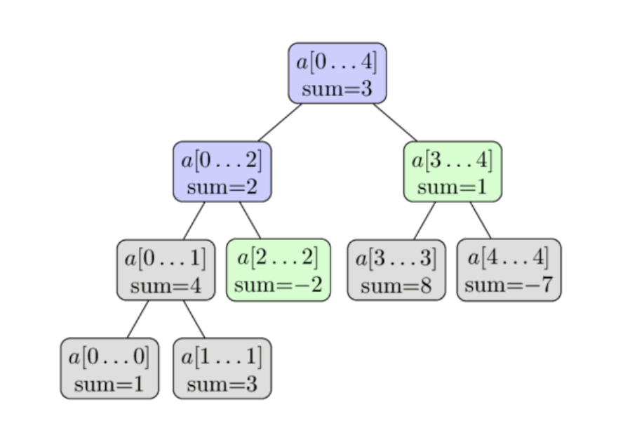

# 🌳 Segment Tree with Trie for Range Max XOR Queries

This project implements a **Segment Tree**, where each segment node stores a **Trie** (prefix tree) to handle **efficient range queries for maximum XOR values**. It also supports dynamic **point updates** to modify array values.

---

  

---

## 📘 What is a Segment Tree?

A **Segment Tree** is a binary tree used for answering range queries like sum, min, max, or XOR in **O(log n)** time. Each node represents a segment (or range) of the array and stores precomputed data about that range.

Segment Trees allow:
- Fast queries over subarrays
- Efficient updates to single elements

---

## 🌲 What is a Trie?

A **Trie**, or prefix tree, is a special tree used to store binary representations or strings. It allows for:
- Fast insertions
- Efficient XOR-based queries

In this project, each node in the segment tree holds a **binary Trie** that stores all elements in its range. This allows us to find the **maximum XOR** of a number with elements in any range.

---

## 🚀 Project Functionality

The code supports two types of operations:

| Command | Description |
|---------|-------------|
| `1 index new_value` | Updates the element at `index` with `new_value`. |
| `2 l r x` | Returns the maximum XOR of `x` with any number in the range `[l, r]`. |

---

## 🧠 How It Works

### Insertion Phase:
- Build a segment tree recursively.
- Each segment node contains a binary trie storing the numbers in its range.

### Query Phase (`maxxor`):
- Find the segment(s) covering the query range.
- For each segment, perform a max XOR operation using its trie.

### Update Phase:
- Remove the old value from the trie at relevant nodes.
- Insert the new value into the trie.

---

## 📥 Input Format

1. First line: `n m` where `n` is array size and `m` is number of operations.
2. Second line: `n` space-separated integers (initial array).
3. Next `m` lines: each contains an operation in one of the following forms:
   - `1 index new_value`
   - `2 l r x`

---

## 📌 Technical Highlights

- Trie depth: up to 20 bits (for numbers < 2^20)

- Efficient updates: Remove + Insert in all segment trie paths

- Memory: Each segment node stores its own independent trie

- Time complexity:

   - Build: O(n log n)

   - Update: O(log n × 20)

   - Query: O(log n × 20)

---

