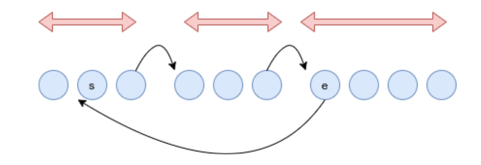

# 📦 Linked List and Radical Decomposition

This project implements a **linked list** data structure combined with a **radical decomposition** strategy (a variant of square root decomposition). It efficiently supports range-based operations on dynamic data, including **element relocation** and **value queries**.

---

  

---

## 🔍 What Is Radical Decomposition?

Radical decomposition (or square root decomposition) is a technique used to optimize operations on arrays or lists. The idea is to break a large structure into smaller chunks (segments) of approximately √n size to reduce the time complexity of certain operations.

---

## 💡 Key Features

- **Custom Singly Linked List** implementation.
- **Segmentation of data** into √n linked sublists (buckets).
- Supports the following operations:
  - **Move an element** from one position to another (`O(√n)`).
  - **Query the value** at a given position (`O(√n)`).

---

## 🧠 How It Works

### Step 1: Input and Segmentation
- Takes input for `n` elements and a number of queries `m`.
- Divides the list into approximately √n segments using **linked lists**.
- Each segment holds roughly equal number of elements.

### Step 2: Query Types

#### Type 1: Move Element  
**Input:** `1 s e`  
Moves the element at position `e` to position `s`.  
- Elements are removed and reinserted while preserving segment structure.
- The last element of previous segments is shifted as needed to balance the segments.

#### Type 2: Get Element  
**Input:** `2 s`  
Returns the value at position `s`.  
- Retrieves the element directly from the correct segment.

---

## 🏗 Data Structures Used

- `LinkedList`: Custom singly linked list with `insert`, `remove`, and `get` functions.
- `Node`: Represents each element in the list.
- `LinkedList* lists[]`: Array of linked lists representing the segmented structure.

---

## 📈 Time Complexity

| Operation         | Time Complexity |
|------------------|------------------|
| Move (Type 1)     | O(√n)            |
| Query (Type 2)    | O(√n)            |
| Initialization    | O(n)             |

---

