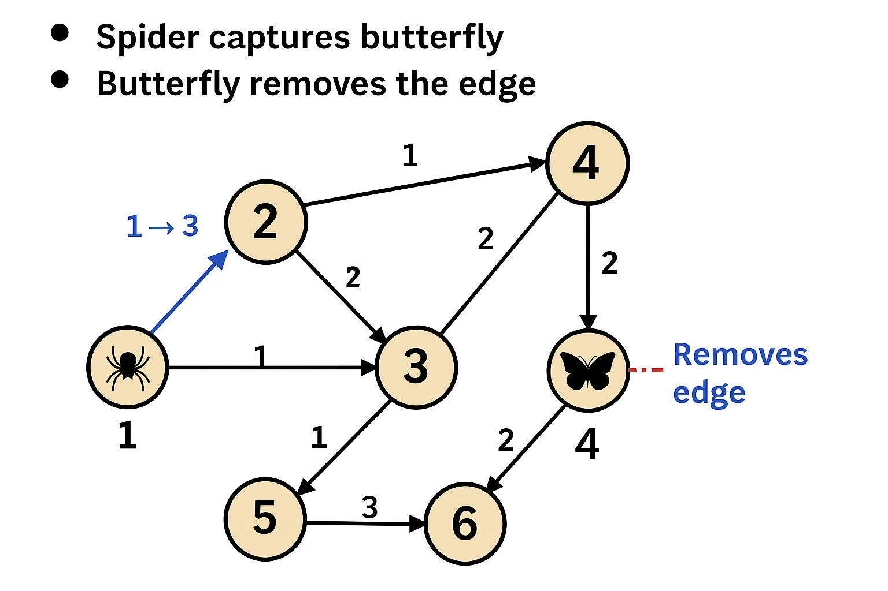

# 🕷️ Butterfly vs Spider – A Graph-Based Strategy Game 

 This C project simulates a game between butterflies and spiders on a user-defined graph. It uses Dijkstra's algorithm to calculate the shortest path between nodes and models strategic moves in a battle for survival.  

**📌 Features**  

+ Graph input as an adjacency matrix.

+ Validates user inputs.

+ Calculates shortest paths using Dijkstra's algorithm.

+ Simulates spider movement toward butterflies.

+ Allows butterflies to remove edges to avoid spiders.

+ Ends when:

+ A spider catches a butterfly,

+ Butterflies isolate themselves from all spiders,

+ Or after 10 spider turns.  

**🧠 How It Works**  

+ The graph is input by the user (symmetric adjacency matrix).

+ Spiders try to reach the nearest butterfly using the shortest path.

+ Butterflies remove edges to prevent spiders from reaching them.

+ The simulation continues until one of the end conditions is met.  

**🏁 Getting Started**  

Follow the prompts to: 

+ Enter the number of nodes in the graph (max 11)

+ Provide the adjacency matrix

+ Define the number and positions of spiders

+ Define the number and positions of butterflies  

**📋 Example Input**  

Number of nodes: 4  

Enter map:  
0 1 1 0 
1 0 0 1 
1 0 0 1 
0 1 1 0  

Number of spiders: 1 
Spider positions: 1  

Number of butterflies: 1 
Butterfly positions: 3  

**🎯 Goal of the Game**  
Spiders: Reach a butterfly node. 

Butterflies: Avoid spiders by removing critical edges.  

**⚙️ Main Algorithms**  

Dijkstra’s Algorithm: For computing shortest paths. 

Graph Traversal & Simulation: To determine movement and disconnection logic.  

